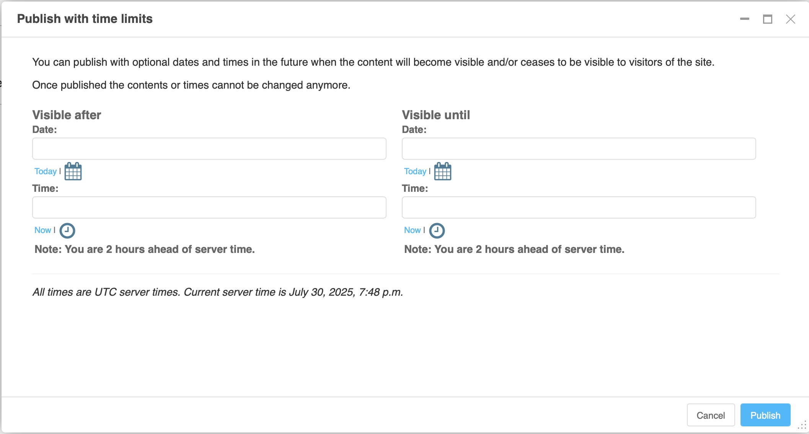

[](http://badge.fury.io/py/djangocms-timed-publishing)
[](https://codecov.io/gh/django-cms/djangocms-timed-publishing)
[](https://pypi.org/project/djangocms-timed-publishing/)
[](https://www.djangoproject.com/)
[](https://www.django-cms.org/)


# djangocms-timed-publishing
django CMS Timed Publishing extends django CMS Versioning to allow for planned or limited publication of content:



## Installation

1. Install the package using pip:

    ```bash
    pip install djangocms-timed-publishing
    ```

2. Add `'djangocms_timed_publishing'` to your `INSTALLED_APPS` in `settings.py`:

    ```python
    INSTALLED_APPS = [
         # ...
         'djangocms_timed_publishing',
         # ...
    ]
    ```

3. Run migrations:

    ```bash
    python manage.py migrate
    ```
